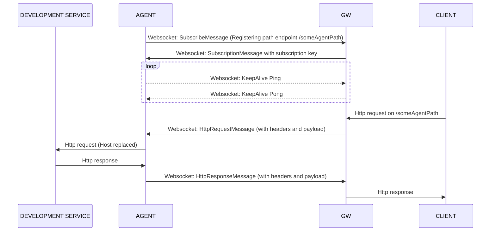

# Enterprise reverse proxy

Consumes incoming HTTP requests and passes it to the remote agents through WebSocket.

## Disclaimer
This project created only for academic proposes and not supposed to be run on production environments.
Using that code or binaries you should accept all security and performance risks.

## Idea

For example, developer, have notebook and working remotely without any "white" IP (public accessible).
But you have a remote host with public static IP and don't have. So what to do?

Let's imagine you run http service which accepts all http traffic and passes it back to you by any channel with all
payload and headers. As soon you will get it you do the same request and to localhost to your "development" service, 
get your response and passes it all back to the requester.

## How it works

Agent is and service that connects to the GW and registers specific path to accept traffic. All exchange between
AGENT and GW goes through Websocket

To start
1) Compile and start gw which creates an WS for agent connections and start accepting http traffic
2) Configure and start agent which h will connect to WS of gw and binds to specific to agent endpoint
3) All traffic coming to that endpoint will be passed to agent without changes
4) Agent getting traffic changes host on incoming http request and passes it to bound local address.
